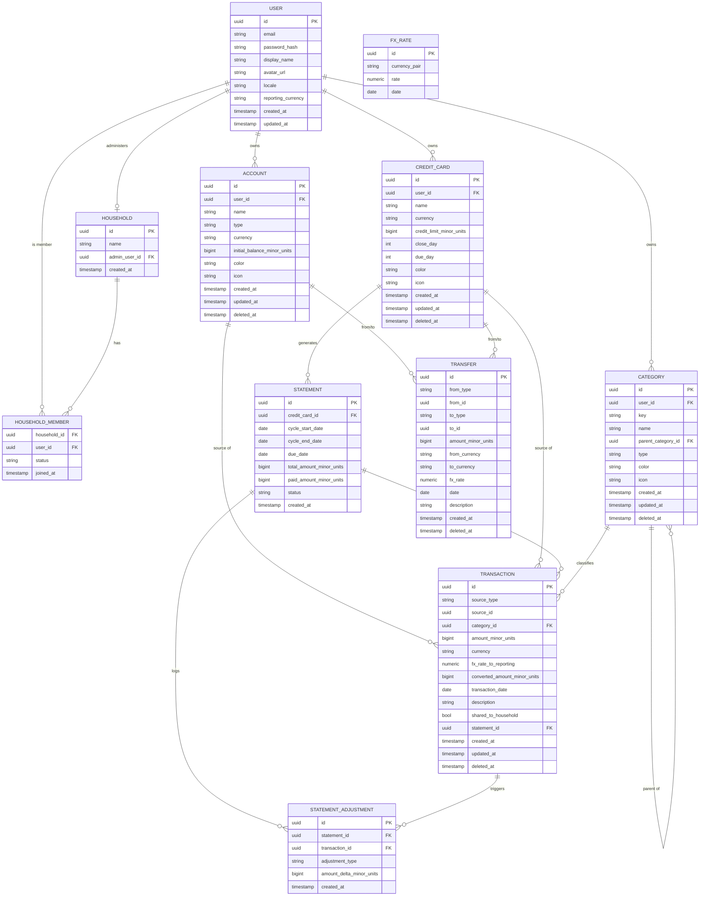

# ER Diagram

> Migrated from Notion on 2026-08-03. Reflects the schema built by `migrations/000001_initial_schema.up.sql`.
> Note: Mermaid's `erDiagram` syntax shown below doesn't annotate nullability, so it won't visibly
> show which columns are `NOT NULL` — check the migration or `.docs/requirements-and-domain-model.md`
> for that.

## Changelog

- **2026-08-03** — Migrated this doc from Notion ("ER Diagram") into the repo; no content changes.
  The Notion page now points here.
